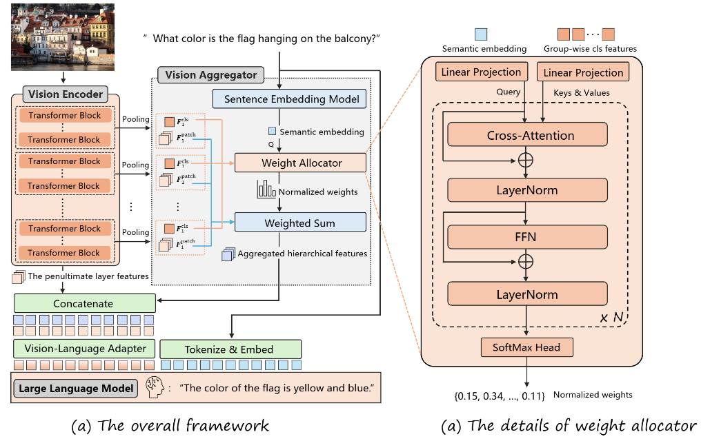

<h2 align="center">Instruction-Guided Fusion of Multi-Layer Visual Features in Large Vision-Language Models</h2>

<div align="center">

</div>

The official implementation of the paper "[Instruction-Guided Fusion of Multi-Layer Visual Features in Large Vision-Language Models](https://arxiv.org/abs/2501.08443)" .


## 📣 News

- **[Dec 26, 2024]** The paper has been released on [arXiv](https://arxiv.org/abs/2501.08443)!
- **[March 10, 2025]**  🔥🔥🔥 Code has been released.

## Table of Contents
- [Performance](#Performance)
- [Framework](#Framework)
- [Install](#Install)
- [Training](#Training)

## Performance

<p align="center">
    </a>
</p>

Performance comparison of our method against the baseline model ([LLaVA-1.5](https://github.com/haotian-liu/LLaVA)) and two competing fusion approaches([MMFuser](https://github.com/yuecao0119/MMFuser) and [DenseConnector](https://github.com/HJYao00/DenseConnector)).


## Framework

The overall framework is illustrated. It consists of four main modules: a vision encoder $V$, a vision-language adapter $ADP$, an instruction-guided vision aggregator $\mathit{IGVA}$, and an LLM. For demonstration purposes, we use the widely adopted LLaVA-v1.5  as the implementation framework.



**Vision Encoder**  
We use CLIP-ViT as the vision encoder. It divides an input image $\mathbf{I} \in \mathbb{R}^{C \times H \times W}$ into small patches and processes the patch sequence through a stack of transformer layers. The hierarchical output of the vision encoder is:

```math
\mathbf{F} = V(\mathbf{I}) \in \mathbb{R} ^ {L \times (N+1) \times D},
```

where $L$ is the number of transformer layers, $N$ is the number of patches, and $D$ is the hidden dimension. Each layer produces $N+1$ features, as a `<cls>` token is prepended to the patch sequence to aggregate global information.

---

**Instruction-guided Vision Aggregator**  
The key innovation of our method is the vision aggregator, which dynamically integrates hierarchical visual features based on task instructions. We divide the $L$ layers of the vision encoder into $K$ groups, each containing $L/K$ consecutive layers. For each group, average pooling is applied to the `<cls>` hidden states to obtain a group-wise global feature:

```math
\mathbf{F}^{cls}_{k} = \mathit{Avg}(\mathbf{cls}_{k_1}, \mathbf{cls}_{k_2}, ..., \mathbf{cls}_{k_{L/K}}) \in \mathbb{R}^{ D}, \quad \text{for } k = 1, 2, ..., K,
```

where $\mathbf{cls}_{k_i} \in \mathbb{R}^{D}$ is the `<cls>` feature of the i-th layer in group $k$. The aggregator comprises a sentence embedding model and a weight allocator. The sentence embedding model encodes the textual instruction into a semantic embedding $\mathbf{s}$, which is passed to the weight allocator to compute the importance of each visual group:

```math
\mathbf{w} = \mathit{IGVA}(\mathbf{s}, \mathbf{F}^{cls}_{1}, \mathbf{F}^{cls}_{2}, ..., \mathbf{F}^{cls}_{K}) \in \mathbb{R}^{K}, \quad \text{where } \sum_{k=1}^K w_k = 1.
```

For each group, we apply average pooling to the patch features. Then, we perform weighted summation across the pooled features using the weight vector $\mathbf{w}$:

```math
\mathbf{F}^{patch}_k = \mathit{Avg}(\mathbf{F}^{patch}_{k_1}, \mathbf{F}^{patch}_{k_2}, ..., \mathbf{F}^{patch}_{k_{L/K}}) \in \mathbb{R} ^ {N \times D}, \quad \text{for } k = 1, ..., K.
```

```math
\mathbf{F}_{fused} = \sum_{k=1}^K w_k \times \mathbf{F}^{patch}_k \in \mathbb{R} ^ {N \times D},
```

where $\mathbf{F}^{patch}_{k_i} \in \mathbb{R}^{N\times D}$ represents the patch features of the i-th layer in group $k$. Finally, to preserve semantic richness, the fused features are concatenated with the penultimate layer’s features to form the final visual representation:

```math
\hat{\mathbf{F}} = \mathit{Concate}(\mathbf{F}_{fused}, \mathbf{F}_{penultimate}) \in \mathbb{R} ^ {N \times 2D}.
```

---

**Vision-Language Adapter**  
The vision-language adapter aligns the final visual representation with the embedding space of the LLM. It consists of a two-layer MLP with a GELU activation function:

```math
ADP(\hat{\mathbf{F}}) = \mathit{Proj}_2(\mathit{GELU}(\mathit{Proj}_1(\hat{\mathbf{F}}))) \in \mathbb{R} ^ {N \times D_t},
```

where $D_t$ is the hidden dimension of the LLM.

---

**Large Language Model**  
The LLM first tokenizes the textual instruction and computes embeddings for each token. These text embeddings are then concatenated with the aligned visual features along the sequence dimension. The resulting combined sequence is processed through a stack of transformer layers, ultimately generating a textual response.


## Install

1. Clone this repository and navigate to IGVA folder
    ```bash
    git clone git@github.com:YiZheng-zy/IGVA.git
    cd IGVA
    ```
    


2.Install Package Our project is based on [LLaVA-1.5](https://github.com/haotian-liu/LLaVA) and creates relevant environments according to [LLaVA-1.5 Install](https://github.com/haotian-liu/LLaVA?tab=readme-ov-file#install).


    conda create -n IGVA python=3.10 -y
    conda activate IGVA
    pip install --upgrade pip  
    pip install -e .
    

3. Install additional packages

   Flash-Attention is needed.

    ```bash
    pip install -e ".[train]"
    pip install flash-attn==2.3.6 --no-build-isolation
    ```

## Training
Our training pipeline and datasets  are directly borrowed from [LLaVA-v1.5](https://github.com/haotian-liu/LLaVA). The training consists of two stages: 
- *Pretraining*: Train a projector on a subset of ~558K image-text pairs to connect a frozen pretrained vision encoder and a frozen LLM.
    ```bash
    sh scripts/v1_5/pretrain_balance.sh
    ```
- *Instruction Tuning*: Fine tune the entire MLLM using multimodal instruction data LLaVA-665K.
    ```bash
    sh scripts/v1_5/finetune_balance.sh
    ```

## Inference
···python
python 


## 👍 Acknowledgement

- [LLaVA](https://github.com/haotian-liu/LLaVA): The codebase we built upon.

## 🔒 License

- The majority of this project is released under the Apache 2.0 license as found in the [LICENSE](https://github.com/yuecao0119/MMFuser/blob/main/LICENSE) file.
- The service is a research preview intended for non-commercial use only, subject to the model [License](https://github.com/facebookresearch/llama/blob/main/MODEL_CARD.md) of LLaMA and [Terms of Use](https://openai.com/policies/terms-of-use) of the data generated by OpenAI. Please contact us if you find any potential violation.

## Citation

If this work is helpful for your research, please consider citing the following BibTeX entry.

```
@article{li2024instruction,
  title={Instruction-Guided Fusion of Multi-Layer Visual Features in Large Vision-Language Models},
  author={Li, Xu and Zheng, Yi and Chen, Haotian and Chen, Xiaolei and Liang, Yuxuan and Lai, Chenghang and Li, Bin and Xue, Xiangyang},
  journal={arXiv preprint arXiv:2501.08443},
  year={2024}
}
```
