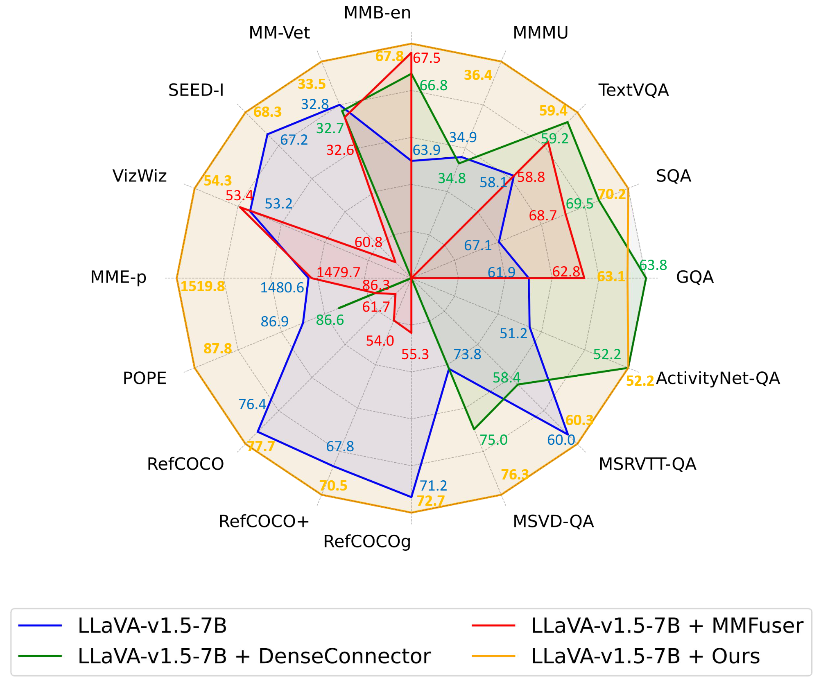
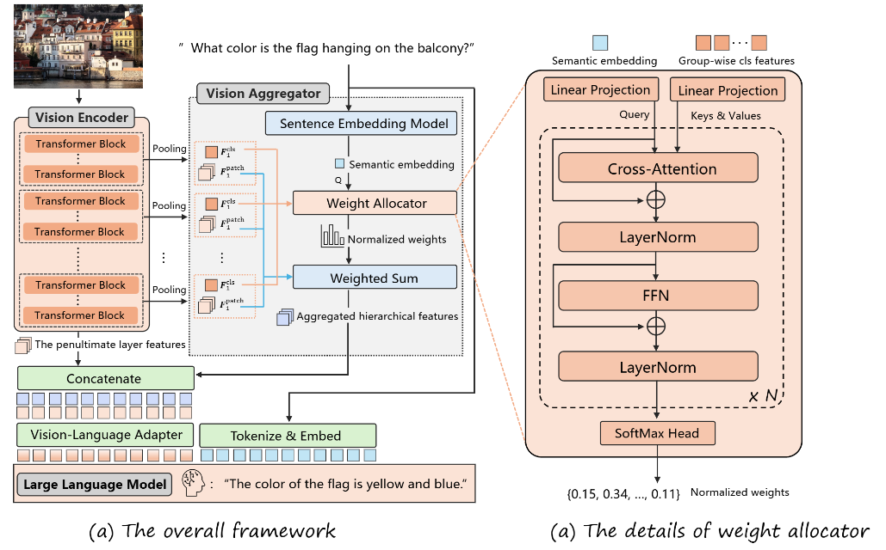

<h2 align="center">Instruction-Guided Fusion of Multi-Layer Visual Features in Large Vision-Language Models</h2>

<div align="center">

[English](README.md) | 简体中文

</div>

The official implementation of the paper "[Instruction-Guided Fusion of Multi-Layer Visual Features in Large Vision-Language Models](https://arxiv.org/abs/2501.08443)" 的官方实现。


## 📣 新闻

- **[Dec 26, 2024]** The paper has been released on [arXiv](https://arxiv.org/abs/2501.08443)发布！
- **[March 10, 202]**  🔥🔥🔥 Code has been released.

## 目录
- [Performance](#Performance)
- [Framework](#Framework)
- [安装](#安装)
- [训练](#训练)
- [评估](#评估)

## Performance

<p align="center">
    </a>
</p>

Performance comparison of our method against the baseline and competing approaches.
+ We systematically analyze how hierarchical visual features influence LVLM
performance across diverse task categories. Our findings reveal that different
layers of the vision encoder play distinct roles, emphasizing the necessity of
task-aware feature fusion rather than static fusion strategies.
+ We propose an instruction-guided vision aggregator, which dynamically assigns
fusion weights to hierarchical visual features based on task-specific instructions.
This mechanism enables LVLMs to selectively emphasize task-relevant features,
improving adaptability without increasing the number of visual tokens.
+ We integrate the proposed vision aggregator into the LLaVA-v1.5 framework,
achieving significant improvements over the baseline and surpassing existing
hierarchical visual feature fusion methods as well as similarly scaled LVLMs

<p align="center">
    </a>
</p>


## Framework
<p align="center">
    </a>
</p>
The overall framework is illustrated in Fig~\ref{fig:framework}(a). It consists of 4 main modules: a vision encoder $V$, a vision-language adapter $ADP$, an instruction-guided vision aggregator $\mathit{IGVA}$, and an LLM. For demonstration purposes, we use the widely adopted LLaVA-v1.5 \cite{llava1.5} as the implementation framework.

{#fig:framework}

**Vision Encoder**  
We use CLIP-ViT \cite{clip} as the vision encoder. It divides an input image $\mathbf{I} \in \mathbb{R}^{C \times H \times W}$ into small patches and processes the patch sequence through a stack of transformer layers. The hierarchical output of the vision encoder is:

$$
\mathbf{F} = V(\mathbf{I}) \in \mathbb{R} ^ {L \times (N+1) \times D},
$$

where $L$ is the number of transformer layers, $N$ is the number of patches, and $D$ is the hidden dimension. Each layer produces $N+1$ features, as a `<cls>` token is prepended to the patch sequence to aggregate global information.

---

**Instruction-guided Vision Aggregator**  
The key innovation of our method is the vision aggregator, which dynamically integrates hierarchical visual features based on task instructions. We divide the $L$ layers of the vision encoder into $K$ groups, each containing $L/K$ consecutive layers. For each group, average pooling is applied to the `<cls>` hidden states to obtain a group-wise global feature:

$$
\mathbf{F}^{cls}_{k} = \mathit{Avg}(\mathbf{cls}_{k_1}, \mathbf{cls}_{k_2}, ..., \mathbf{cls}_{k_{L/K}}) \in \mathbb{R}^{ D}, \quad for \ k = 1, 2, ..., K,
$$

where $\mathbf{cls}_{k_i} \in \mathbb{R}^{D}$ is the `<cls>` feature of the i-th layer in group $k$. The aggregator comprises a sentence embedding model and a weight allocator. The sentence embedding model encodes the textual instruction into a semantic embedding $\mathbf{s}$, which is passed to the weight allocator to compute the importance of each visual group:

$$
\mathbf{w} = \mathit{IGVA}(\mathbf{s}, \mathbf{F}^{cls}_{1}, \mathbf{F}^{cls}_{2}, ..., \mathbf{F}^{cls}_{K}) \in \mathbb{R}^{K}, \quad where \sum_{k=1}^K w_k = 1.
$$

For each group, we apply average pooling to the patch features. Then we perform weighted summation across the pooled features using the weight vector $\mathbf{w}$:

$$
\mathbf{F}^{patch}_k = \mathit{Avg}(\mathbf{F}^{patch}_{k_1}, \mathbf{F}^{patch}_{k_2}, ..., \mathbf{F}^{patch}_{k_{L/K}}) \in \mathbb{R} ^ {N \times D}, \quad for \ k = 1, ..., K.
$$

$$
\mathbf{F}_{fused} = \sum_{k=1}^K w_k \times \mathbf{F}^{patch}_k \in \mathbb{R} ^ {N \times D},
$$

where $\mathbf{F}^{patch}_{k_i} \in \mathbb{R}^{N\times D}$ represents the patch features of the i-th layer in group $k$. Finally, to preserve semantic richness, the fused features are concatenated with the penultimate layer’s features to form the final visual representation:

$$
\hat{\mathbf{F}} = \mathit{Concate}(\mathbf{F}_{fused}, \mathbf{F}_{penultimate}) \in \mathbb{R} ^ {N \times 2D}.
$$

---

**Vision-Language Adapter**  
The vision-language adapter aligns the final visual representation with the embedding space of the LLM. It consists of a two-layer MLP with a GELU activation function:

$$
ADP(\hat{\mathbf{F}}) = \mathit{Proj}_2(\mathit{GELU}(\mathit{Proj}_1(\hat{\mathbf{F}}))) \in \mathbb{R} ^ {N \times D_t},
$$

where $D_t$ is the hidden dimension of the L

### 通用多模态基准测试的结果

<p align="center">
    </a>
</p>

不同模型大小的性能比较。 （左）与包括 Qwen-VL-Chat、LLaVA-1.5-7B 在内的 7B 模型相比，我们的模型在 12 个基准测试中的 11 个上实现了 SoTA。 （右）与包括 InstructBLIP、LLaVA-1.5-13B 在内的 13B 模型相比，我们的模型在 12 个基准测试中的 10 个上实现了 SoTA。

与传统 VQA 基准测试和最近的多模式基准测试上最先进的 VLLM 进行比较。最佳结果以 **粗体** 标记，第二好结果以 <u>下划线</u> 标记。

<p align="center">
    </a>
</p>

加入MMFuser后，LLaVA-1.5的性能得到了大幅提升，在多个基准测试中超越了LLaVA-1.5。
其中，在Vizwiz、MME和MMBench上的得分分别为57.4、
1585.2和69.9，分别比LLaVA-1.5高出3.8分、53.9分和2.2分。

### OCRBench 上的结果

OCRBench 是一个全面的 OCR 基准，包含 1,000 条手动整理和校正的 OCR 相关 VQA 指令。如表所示，我们的模型有 7B 和 13B 个参数，与 LLaVA-1.5 相比平均提高了 15 分。

<p align="center">
    </a>
</p>

### 区域级基准测试的结果

为了评估区域理解和基础能力，我们在两个具有代表性的区域级任务上评估了 MMFuser。

1. 区域字幕结果
在区域字幕任务中，我们的模型显示出显着的改进。如表所示，与 LLaVA-1.5 相比，MMFuser 的 7B 模型平均比 LLaVA-1.5 提高了 2.5 分，而 13B 版本则提高了 3.9 分。

2. 指称表达理解 (REC) 的结果
如表所示，我们的模型在指称表达理解基准测试中始终优于 LLaVA-1.5 模型，与 LLaVA-1.5-7B 相比，7B 模型的平均改进尤其显著，为 5.7 分。

<p align="center">
    </a>
</p>

### 视觉表现的可视化

为了直观地验证 MMFuser 对视觉特征的影响，我们在图中展示了四个示例图像的输入和输出特征图可视化。

<p align="center">
    </a>
</p>


## 安装

1. 克隆此存储库并切换到MMFuser文件夹
    ```bash
    git clone git@github.com:yuecao0119/MMFuser.git
    cd MMFuser
    ```

2. 安装程序包

    我们的项目基于[LLaVA-1.5](https://github.com/haotian-liu/LLaVA)并根据[LLaVA-1.5安装](https://github.com/haotian-liu/LLaVA?tab=readme-ov-file#install)创建相关环境。

    ```bash
    conda create -n MMFuser python=3.10 -y
    conda activate MMFuser
    pip install --upgrade pip  # enable PEP 660 support
    pip install -e .
    ```

3. 安装其他软件包

    安装Flash-Attention：

    ```bash
    pip install -e ".[train]"
    pip install flash-attn==2.3.6 --no-build-isolation
    ```

    在我们的项目中使用了[Deformation-DETR](https://github.com/fundamentalvision/Deformable-DETR/tree/main)中的可变形注意力机制。需要运行以下脚本编译CUDA算子：

    ```bash
    cd llava/model/multimodal_projector/deformable_attention/ops
    sh ./make.sh
    # unit test
    python test.py
    ```


## 训练

我们的训练管线和数据集直接取自[LLaVA-v1.5](https://github.com/haotian-liu/LLaVA). 训练包括两个阶段：
- *预训练*: 在~558K图像-文本对的子集上训练projector，以连接冻结的预训练视觉编码器和冻结的大语言模型。
    ```bash
    sh scripts/mmfuser/pertrain.sh
    ```
- *指令微调*: 利用多模态指令数据LLaVA-665K对整个MLLM进行微调。
    ```bash
    sh scripts/mmfuser/finetune.sh
    ```

## 评估

我们遵循[LLaVA-v1.5](https://github.com/haotian-liu/LLaVA/tree/main)进行评估。您应该下载[eval.zip](https://drive.google.com/file/d/1atZSBBrAX54yYpxtVVW33zFvcnaHeFPy/view?usp=sharing)，并将其解压缩到`./playground/data/eval`。请参考[Evaluation.md](./docs/Evaluation.md)准备数据。

然后，您可以在`scripts/v1_5/eval`中运行我们的评估脚本。

并且您可以通过以下代码进行模型推理：

```bash
sh scripts/mmfuser/inference.sh
```

## 👍 致谢

- [LLaVA](https://github.com/haotian-liu/LLaVA) ：我们基于该代码库改进。

## 🔒 许可证

- 该项目的大部分内容都是在[LICENSE](https://github.com/yuecao0119/MMFuser/blob/main/LICENSE)文件中的Apache 2.0许可证下发布的。
- 该服务是一个仅用于非商业用途的研究预览，受LLaMA的[License](https://github.com/facebookresearch/llama/blob/main/MODEL_CARD.md)模型和OpenAI生成的数据的[Terms of Use](https://openai.com/policies/terms-of-use)约束。如果您发现任何潜在的违规行为，请与我们联系。

## 引用

如果这项工作对您的研究有帮助，请考虑引用以下 BibTeX 条目。

```
@article{cao2024mmfuser,
  title={MMFuser: Multimodal Multi-Layer Feature Fuser for Fine-Grained Vision-Language Understanding},
  author={Cao, Yue and Liu, Yangzhou and Chen, Zhe and Shi, Guangchen and Wang, Wenhai and Zhao, Danhuai and Lu, Tong},
  journal={arXiv preprint arXiv:2410.11829},
  year={2024}
}
```
